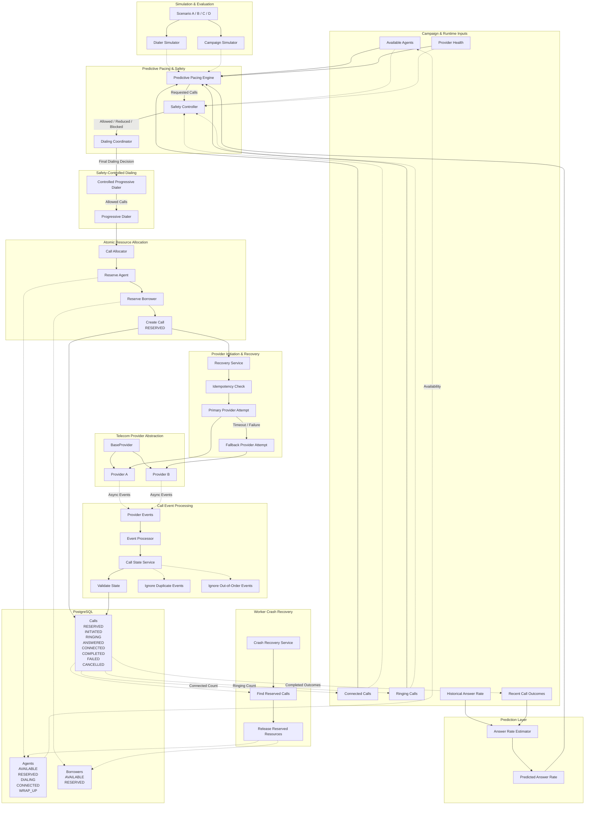

# SmartDialer Architecture

```mermaid
flowchart TB

    %% =====================================================
    %% INPUTS
    %% =====================================================

    subgraph INPUTS["Campaign & Runtime Inputs"]

        direction LR

        A1["Available Agents"]
        A2["Connected Calls"]
        A3["Ringing Calls"]
        A4["Provider Health"]
        A5["Historical Answer Rate"]
        A6["Recent Call Outcomes"]

    end


    %% =====================================================
    %% PREDICTION
    %% =====================================================

    subgraph PREDICTION["Prediction Layer"]

        direction LR

        B1["Answer Rate Estimator"]

        B2["Predicted Answer Rate"]

        B1 --> B2

    end


    A5 --> B1
    A6 --> B1


    %% =====================================================
    %% PACING AND SAFETY
    %% =====================================================

    subgraph DECISION["Predictive Pacing & Safety"]

        direction LR

        C1["Predictive Pacing Engine"]

        C2["Safety Controller"]

        C3["Dialing Coordinator"]

        C1 -->|"Requested Calls"| C2

        C2 -->|"Allowed / Reduced / Blocked"| C3

    end


    B2 --> C1

    A1 --> C1
    A2 --> C1
    A3 --> C1
    A4 --> C1

    A1 -.-> C2
    A2 -.-> C2
    A3 -.-> C2
    A4 -.-> C2


    %% =====================================================
    %% DIALING
    %% =====================================================

    subgraph DIALING["Safety-Controlled Dialing"]

        direction LR

        D1["Controlled Progressive Dialer"]

        D2["Progressive Dialer"]

        D1 -->|"Allowed Calls"| D2

    end


    C3 -->|"Final Dialing Decision"| D1


    %% =====================================================
    %% ATOMIC ALLOCATION
    %% =====================================================

    subgraph ALLOCATION["Atomic Resource Allocation"]

        direction LR

        E1["Call Allocator"]

        E2["Reserve Agent"]

        E3["Reserve Borrower"]

        E4["Create Call<br/>RESERVED"]

        E1 --> E2
        E2 --> E3
        E3 --> E4

    end


    D2 --> E1


    %% =====================================================
    %% PROVIDER INITIATION
    %% =====================================================

    subgraph PROVIDER_SERVICE["Provider Initiation & Recovery"]

        direction LR

        G1["Recovery Service"]

        G2["Idempotency Check"]

        G3["Primary Provider Attempt"]

        G4["Fallback Provider Attempt"]

        G1 --> G2
        G2 --> G3
        G3 -->|"Timeout / Failure"| G4

    end


    E4 --> G1


    %% =====================================================
    %% PROVIDERS
    %% =====================================================

    subgraph PROVIDERS["Telecom Provider Abstraction"]

        direction LR

        H1["BaseProvider"]

        H2["Provider A"]

        H3["Provider B"]

        H1 --> H2
        H1 --> H3

    end


    G3 --> H2

    G4 --> H3


    %% =====================================================
    %% EVENT PROCESSING
    %% =====================================================

    subgraph EVENTS["Call Event Processing"]

        direction LR

        I1["Provider Events"]

        I2["Event Processor"]

        I3["Call State Service"]

        I4["Validate State"]

        I5["Ignore Duplicate Events"]

        I6["Ignore Out-of-Order Events"]

        I1 --> I2
        I2 --> I3

        I3 --> I4
        I3 -.-> I5
        I3 -.-> I6

    end


    H2 -.->|"Async Events"| I1
    H3 -.->|"Async Events"| I1


    %% =====================================================
    %% DATABASE
    %% =====================================================

    subgraph DB["PostgreSQL"]

        direction LR

        F1["Agents<br/>AVAILABLE<br/>RESERVED<br/>DIALING<br/>CONNECTED<br/>WRAP_UP"]

        F2["Borrowers<br/>AVAILABLE<br/>RESERVED"]

        F3["Calls<br/>RESERVED<br/>INITIATED<br/>RINGING<br/>ANSWERED<br/>CONNECTED<br/>COMPLETED<br/>FAILED<br/>CANCELLED"]

    end


    E2 -.-> F1
    E3 -.-> F2
    E4 --> F3

    I4 --> F3


    %% =====================================================
    %% RUNTIME FEEDBACK
    %% =====================================================

    F1 -.->|"Availability"| A1

    F3 -.->|"Connected Count"| A2

    F3 -.->|"Ringing Count"| A3

    F3 -.->|"Completed Outcomes"| A6


    %% =====================================================
    %% WORKER CRASH RECOVERY
    %% =====================================================

    subgraph RECOVERY["Worker Crash Recovery"]

        direction LR

        J1["Crash Recovery Service"]

        J2["Find Reserved Calls"]

        J3["Release Reserved Resources"]

        J1 --> J2
        J2 --> J3

    end


    F3 -.-> J2

    J3 -.-> F1
    J3 -.-> F2


    %% =====================================================
    %% SIMULATION
    %% =====================================================

    subgraph SIMULATION["Simulation & Evaluation"]

        direction LR

        K1["Scenario A / B / C / D"]

        K2["Dialer Simulator"]

        K3["Campaign Simulator"]

        K1 --> K2
        K1 --> K3

    end


    K2 -.-> C1

    K3 -.-> C1

```